# Parcial2-AREP

## Descripción/Explicación

Para el parcial se pide realizar la siguiente arquitectura


En esta arquitectura se nos pide realizar despliegue de 3 ec2 en AWS, el uso de los ec2 es el siguiente:
- Un EC2 que va a funcionar como Proxy para distribuir cargas (Se distribuye mediante el algoritmo de Round-robin).
- Dos EC2 los cuales van a funcionar como diferentes instancias de MathServices(La encargada de realizar las funciones de factors y primes)

## Funcionamiento (Ejemplo)

Nota: El ejemplo se va a mostrar con todas las instancias de EC2 ejecutandose, no en local.

Primeramente nos vamos a dirigir a la siguiente dirección la cual es la del proxy:

```
http://ec2-54-221-144-222.compute-1.amazonaws.com:8080/
```
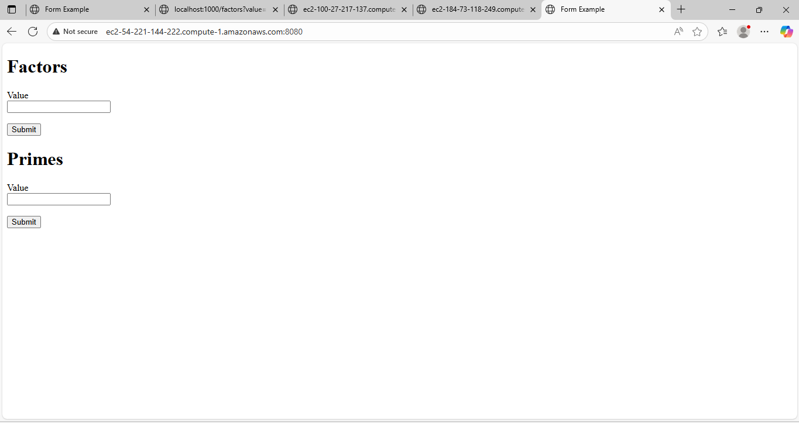

Ahora podemos observar el HTML del proyecto, ahora probaremos cada una de las funciones.

### Factors

Se ingresan los valores de prueba que se dieron en la explicación del ejercicio y los comparamos.

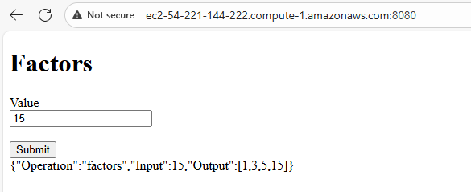

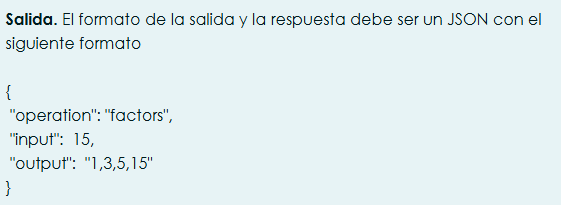

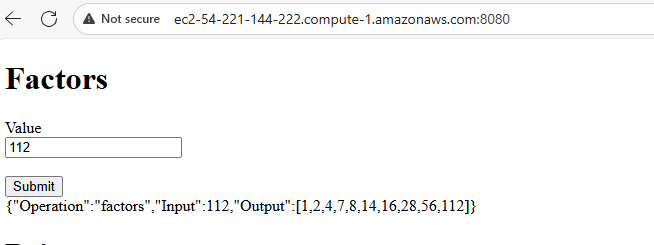

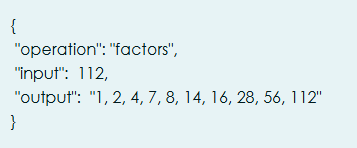

Como se evidencia funcionan correctamente.

### Primes

Se ingresa el valor de prueba que se nos dio en el documento de la explicación del ejercicio.

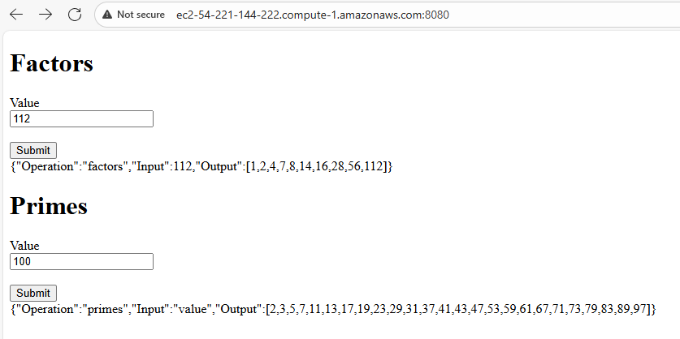

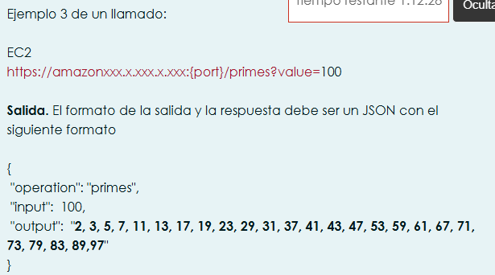

Se puede evidenciar que funciona de manera correcta.

### Evidencia Round-robin

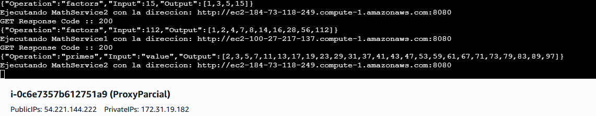

Se puede evidenciar en la consola del proxy que se estan distribuyendo entre las maquinas las distintas peticiones que se estan realizando.

### Evidencia Factors directamente

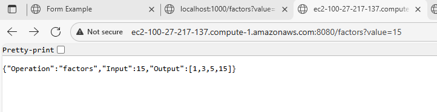

### Evidencia Primes directamente

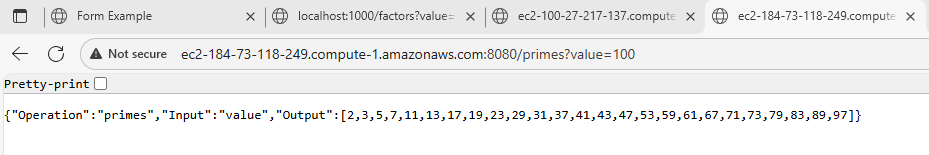

## Cómo correrlo

Se va a explicar como correr el ejercicio en este caso que ya esta desplegado, no en local.

### Conexión

Primeramente nos debemos conectar a las tres instancias de EC2 que se crearon (ya sea por consola o por la interfaz de AWS).

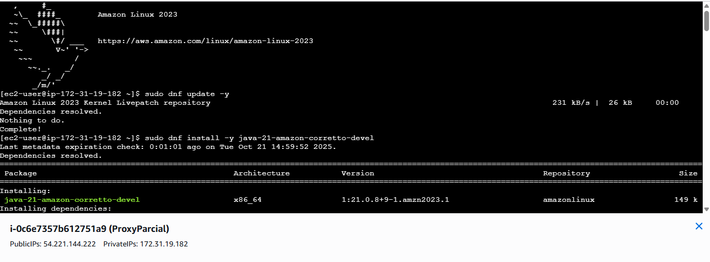

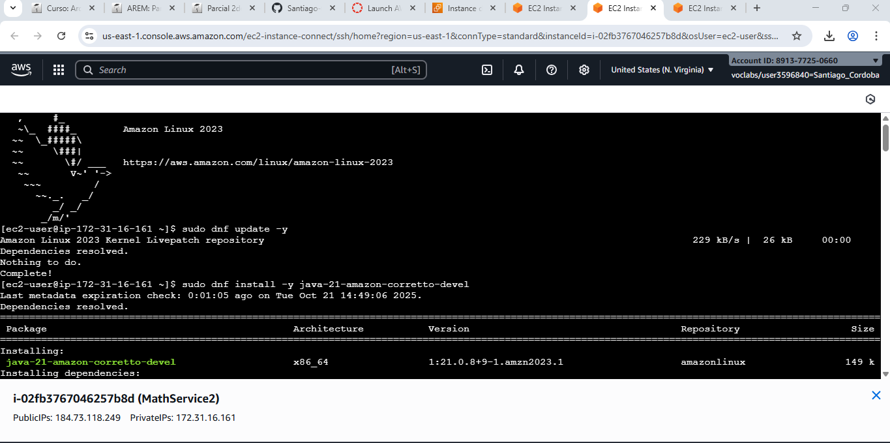

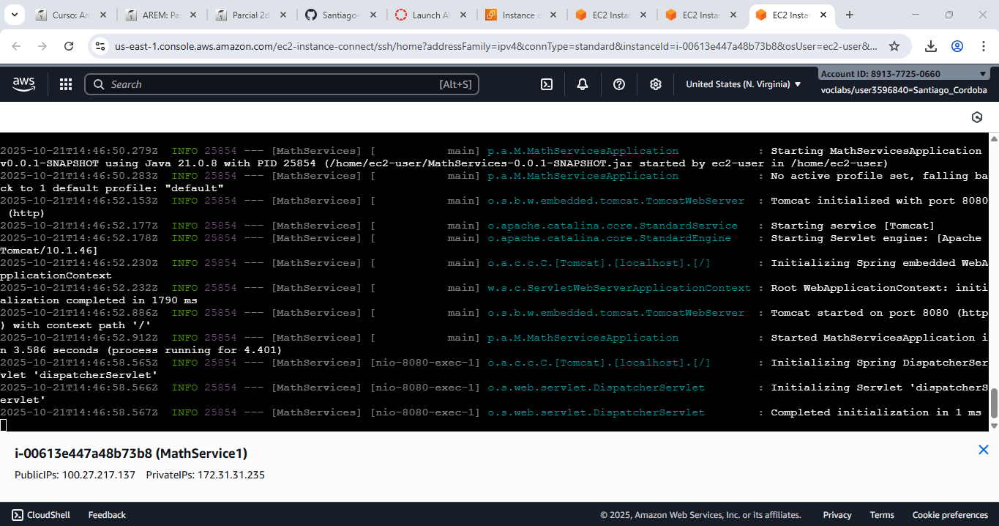

### Ejecución JAR

Previamente ya se subio el JAR correspondiente a cada una de las instacias por lo cual lo unico que se necesita es ejecutarlo.

- Comando para el Proxy
```
java -jar Proxy-0.0.1-SNAPSHOT.jar
```

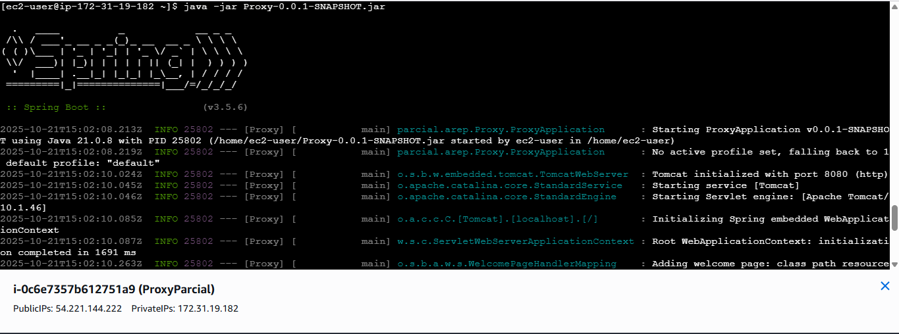

- Comando para los MathServices
```
java -jar MathServices-0.0.1-SNAPSHOT.jar
```

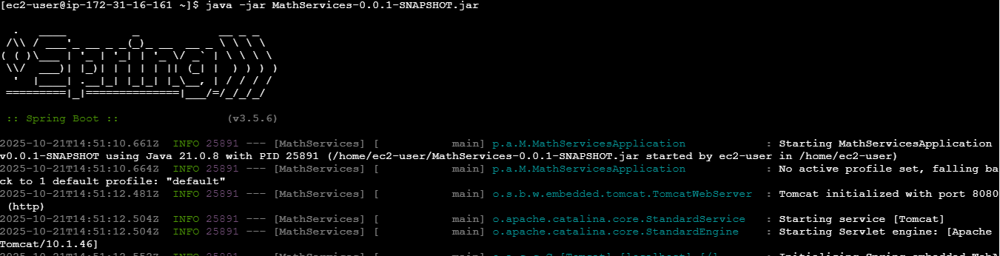

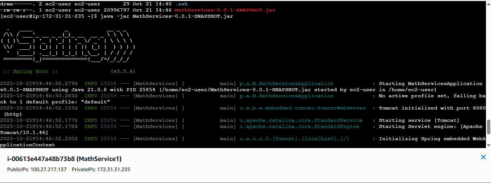

### Prueba

Para probar cada una de las instancias y sus funcionalidades nos dirigimos a las direcciones previamente mencionadas.

- Proxy:
```
http://ec2-54-221-144-222.compute-1.amazonaws.com:8080/
```

- MathService1 ejemplo factors
```
http://ec2-100-27-217-137.compute-1.amazonaws.com:8080/factors?value=15
```

- MathService1 ejemplo primes
```
http://ec2-100-27-217-137.compute-1.amazonaws.com:8080/primes?value=100
```

- MathService2 ejemplo factors
```
http://ec2-184-73-118-249.compute-1.amazonaws.com:8080/factors?value=112
```

-MathService2 ejemplo primes
```
http://ec2-184-73-118-249.compute-1.amazonaws.com:8080/primes?value=112
```

## VIDEO

[Video Demostración](https://pruebacorreoescuelaingeduco-my.sharepoint.com/:v:/g/personal/santiago_cordoba-d_mail_escuelaing_edu_co/EW_w_UzE3KRMoSsczQ9y0cEBUir3QKHAjPibrCVjUwgugg?e=okvdEc&nav=eyJyZWZlcnJhbEluZm8iOnsicmVmZXJyYWxBcHAiOiJTdHJlYW1XZWJBcHAiLCJyZWZlcnJhbFZpZXciOiJTaGFyZURpYWxvZy1MaW5rIiwicmVmZXJyYWxBcHBQbGF0Zm9ybSI6IldlYiIsInJlZmVycmFsTW9kZSI6InZpZXcifX0%3D)
